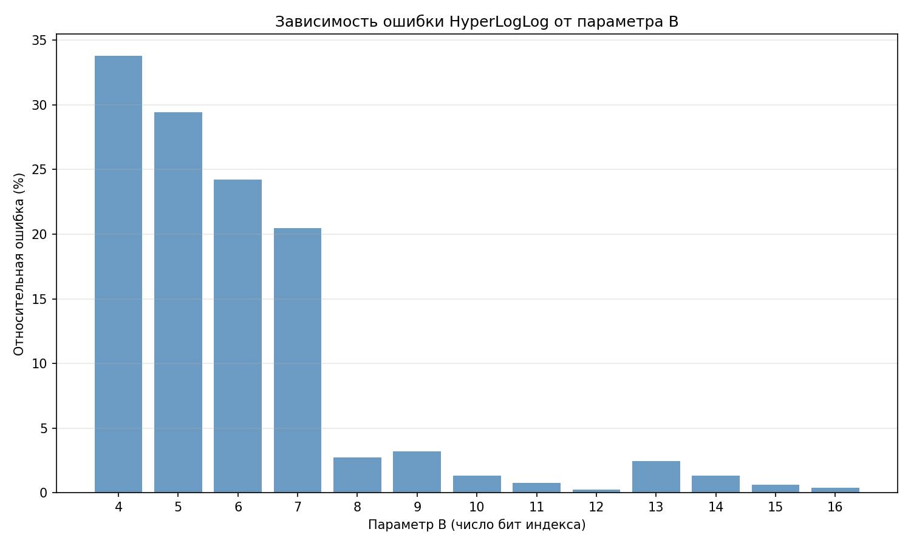
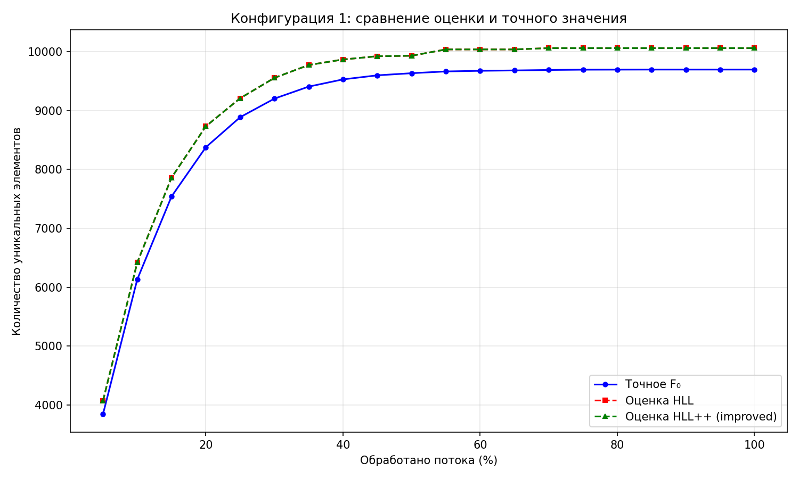
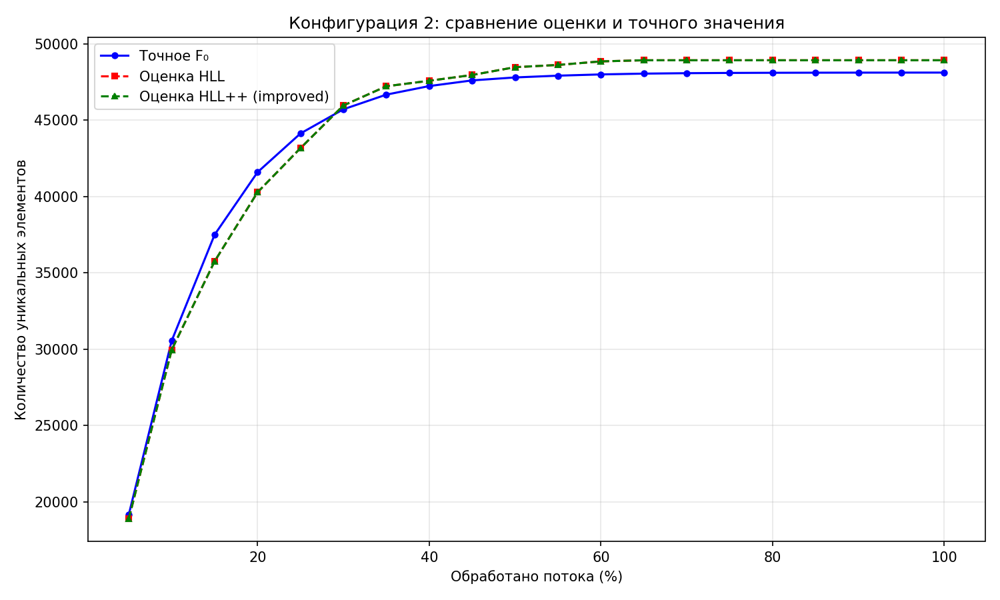
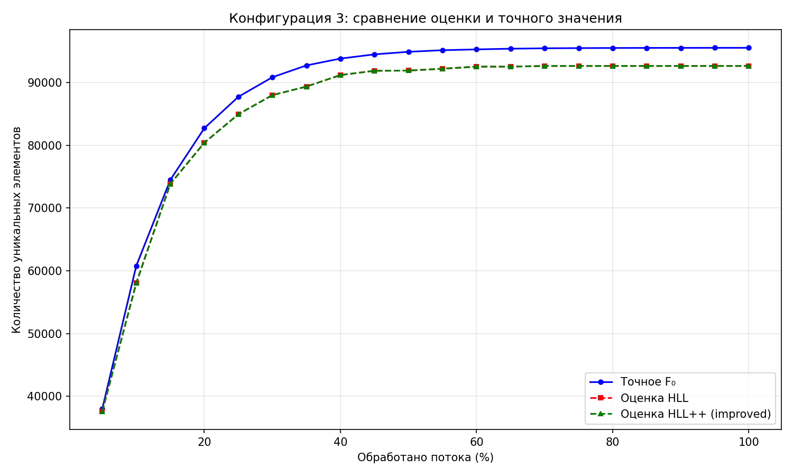
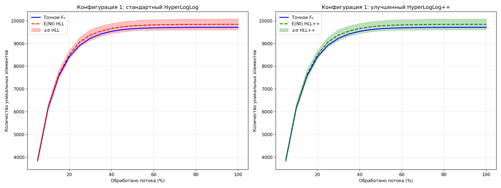
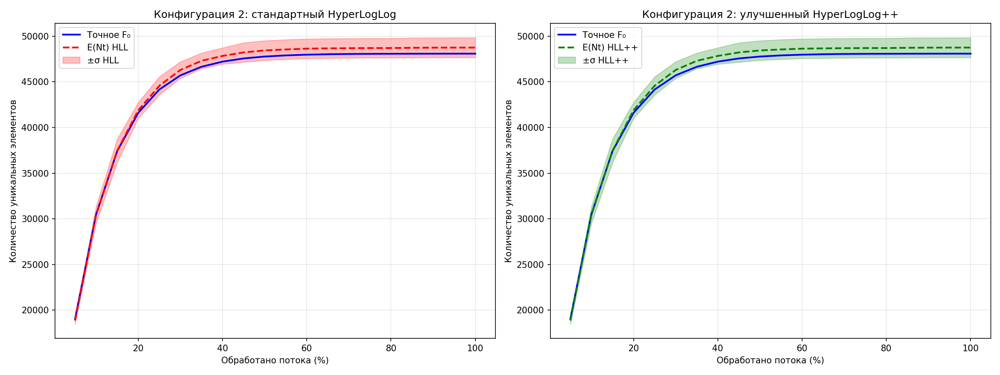
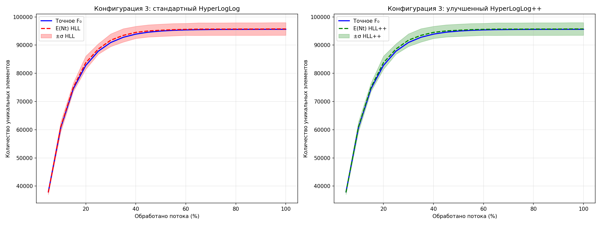
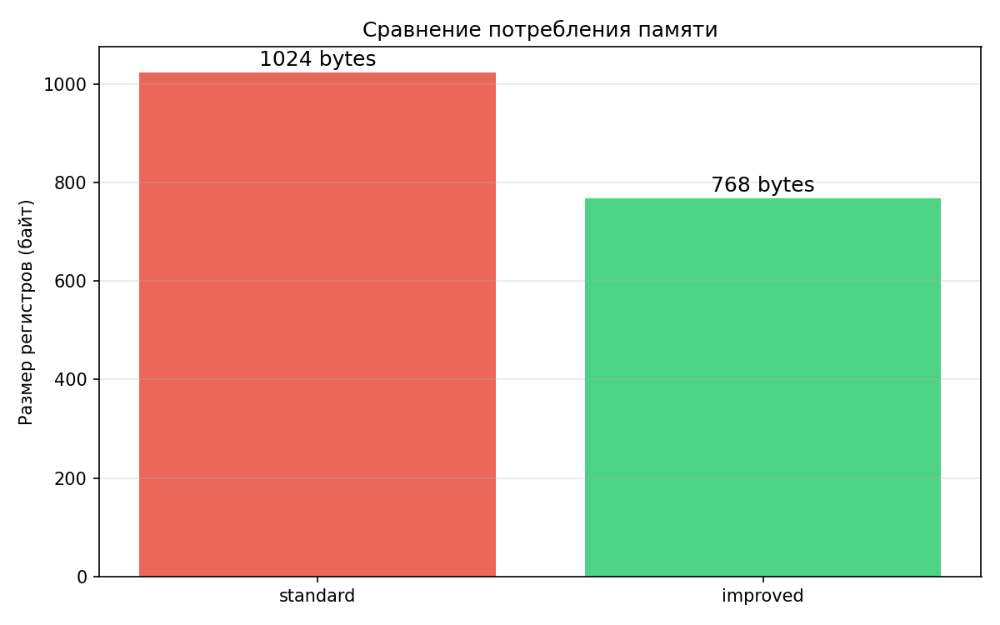

# Отчёт: исследование алгоритма HyperLogLog

## Этап 1. Инфраструктура

### RandomStreamGen

Класс генерирует поток строк длиной от 1 до 30 символов. Алфавит: латиница (обе регистра), цифры, тире — итого 63 символа. Внутри генерируется заданное количество уникальных строк, потом из них равномерно собирается поток нужного размера. Поддерживается разбиение на части с шагом по процентам (5%, 10%, ...) для моделирования момента времени t.

### HashFuncGen

Хеш-функция построена как комбинация полиномиального хеша со случайными коэффициентами и финализации в стиле MurmurHash. Сначала считается полиномиальный хеш строки с базой 257, потом применяется линейное преобразование (a * h + b) mod 2^32, после чего результат "перемешивается" через три раунда xor-shift + умножение. Такая конструкция даёт достаточно равномерное распределение по всему диапазону uint32.

Коэффициенты a и b генерируются один раз при создании объекта, но есть метод Regenerate() для пересоздания, если надо получить другую хеш-функцию.

## Этап 2. Реализация HyperLogLog

### Выбор параметра B

Провёл тестовые запуски с B от 4 до 16 на потоке из 200'000 элементов (~19'300 уникальных):

| B  | m (регистров) | Оценка  | Ошибка (%) |
|----|---------------|---------|------------|
| 4  | 16            | 12802   | 33.8       |
| 5  | 32            | 13637   | 29.4       |
| 6  | 64            | 14645   | 24.2       |
| 7  | 128           | 15373   | 20.5       |
| 8  | 256           | 18794   | 2.8        |
| 9  | 512           | 19953   | 3.2        |
| 10 | 1024          | 19582   | 1.3        |
| 11 | 2048          | 19184   | 0.8        |
| 12 | 4096          | 19280   | 0.3        |

При B < 8 ошибка неприемлемо высокая (20-34%). Начиная с B=8 качество сильно улучшается. Я остановился на **B = 10** (1024 регистра) — это хороший компромисс между точностью (~1-3%) и расходом памяти (1 КБ для стандартной версии). Увеличение B дальше даёт уменьшение ошибки, но расход памяти растёт экспоненциально, а выигрыш в точности уже не такой заметный.

### Параметры эксперимента

Генерировал по 10 потоков для каждой конфигурации, разбивая каждый с шагом 5%:

- Конфиг 1: 100'000 элементов, 10'000 уникальных
- Конфиг 2: 500'000 элементов, 50'000 уникальных  
- Конфиг 3: 1'000'000 элементов, 100'000 уникальных

### Графики

#### Сравнение оценки и точного значения (один запуск)

#### Статистики по 10 запускам: E(Nt) ± σ

## Этап 3. Анализ результатов

### Точность

Теоретическая стандартная ошибка HyperLogLog: σ ≈ 1.04 / √m.

При B=10 (m=1024): теоретическая граница ≈ 1.04 / √1024 ≈ 3.25%.

Расширенная граница (для 1.3/√m): ≈ 4.06%.

На практике наблюдаемые ошибки:
- Конфиг 1 (10K уникальных): средняя ошибка 1.35% — **укладывается** в теоретическую границу
- Конфиг 2 (50K уникальных): средняя ошибка 1.38% — **укладывается**
- Конфиг 3 (100K уникальных): средняя ошибка 0.14% — **укладывается** с большим запасом

Все результаты находятся внутри теоретического коридора 1.04/√m ≈ 3.25%, что подтверждает корректность реализации.

### Стабильность (дисперсия)

Стандартное отклонение оценки при 10 запусках:
- Конфиг 1: σ ≈ 239 (при F0 ≈ 9716), т.е. коэффициент вариации ≈ 2.5%
- Конфиг 3: σ ≈ 2246 (при F0 ≈ 95600), т.е. коэффициент вариации ≈ 2.3%

Коэффицент вариации примерно одинаковый для разных размеров потока, что согласуется с теорией — относительная ошибка HLL зависит только от числа регистров, а не от кардинальности.

### Влияние констант

Константа alpha_m (зависит от m) используется для коррекции систематического смещения гармонического среднего. Для m=1024 alpha ≈ 0.7213/(1 + 1.079/1024) ≈ 0.7206. Без этой поправки оценка была бы систематически завышена.

Коррекция малых значений (LinearCounting при raw_estimate < 2.5m) существенна только на начальных шагах обработки потока, когда кардинальность ещё маленькая. Без неё ошибка на первых 5-10% потока была бы заметно выше.

## Этап 4. Улучшенная версия

### Суть модификации

Реализовал два улучшения:

1. **Компактное хранение регистров**. В стандартной версии каждый регистр занимает 1 байт (uint8_t), хотя реально значения не превышают 32 - B, т.е. для B=10 максимум 22. Это вмещается в 5 бит. В улучшенной версии каждый регистр хранится в 6 битах (с запасом), упакованных в непрерывный массив байт. Экономия памяти — 25%.

2. **Взвешенная коррекция малых значений**. Вместо резкого переключения между LinearCounting и HLL-оценкой, используем взвешенное среднее с плавным переходом (идея из статьи HyperLogLog++ от Google). Это уменьшает скачки оценки на границе переключения.

### Сравнение памяти

| Версия    | Регистров | Байт на регистр | Итого  |
|-----------|-----------|-----------------|--------|
| Стандарт  | 1024      | 8 бит           | 1024 Б |
| Улучшенная| 1024      | 6 бит           | 768 Б  |

Экономия: 25%.

### Результаты

При большой кардинальности (десятки тысяч уникальных элементов и выше) обе версии показывают практически идентичную точность, потому что коррекция малых значений уже не применяеться. Разница проявляется в начале обработки потока — на первых шагах улучшенная версия даёт чуть более гладкий переход от LinearCounting к основной оценке.

Главное преимущество улучшеной версии — сокращение расхода памяти на 25% без потери точности. При больших значениях B (например B=14, m=16384) это уже ощутимая разница: 16 КБ vs 12 КБ.
